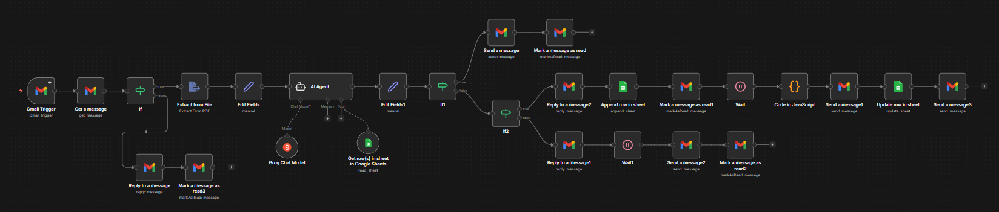

````markdown
# 🤖 AI Recruitment Intelligence Automation Platform

A production-ready AI-powered recruitment automation system that intelligently screens CVs, evaluates candidates using LLM-based scoring, validates applications, classifies applicants, auto-schedules interviews, and streamlines hiring operations with a professional candidate experience.

---

## 🚀 Project Overview

The **AI Recruitment Intelligence Automation Platform** is an end-to-end hiring automation solution designed to reduce manual HR workload and improve recruitment efficiency.

Built using:

- **n8n** – Workflow Automation Engine  
- **Groq LLaMA 3 (70B)** – Large Language Model  
- **Gmail API** – Email Intake & Communication  
- **Google Sheets** – Recruitment CRM & Job Database  
- **JavaScript** – Smart Interview Scheduling Logic  

The system automatically:

- 📥 Monitors incoming candidate applications  
- 📎 Accepts only emails with attachments  
- 📄 Validates CV file format (PDF only)  
- 🧠 Extracts and evaluates candidate profiles using AI  
- 📊 Scores applicants against job requirements  
- 🟢 Classifies candidates (Shortlisted / Rejected / Position Closed)  
- 📅 Generates optimized interview schedules  
- 📧 Sends professional automated responses  
- 🗂 Maintains structured candidate records  
- 👥 Notifies HR team with interview details  

---

## 🎯 Objectives

- Automate CV screening and candidate evaluation  
- Reduce repetitive HR workload  
- Improve response time to applicants  
- Create structured candidate comparison process  
- Improve hiring consistency using AI scoring  
- Deliver scalable recruitment operations  
- Maintain professional candidate communication  

---

# 🧠 Production Workflow Architecture

```text
Inbound CV Email Listener
        ↓
Fetch Candidate Email Content
        ↓
Validate PDF Attachment Format
   ├── Invalid File → Request PDF CV + Mark Reviewed
   └── Valid File
            ↓
Extract CV Text from PDF
            ↓
Prepare Candidate Data Payload
            ↓
AI Candidate Evaluation Engine
            ↓
Fetch Open Job Requirements
            ↓
Normalize Evaluation Results
            ↓
Check Job Vacancy Status
   ├── Closed → Send Position Closed Email
   └── Open
          ↓
Check Candidate Shortlist Status
   ├── Shortlisted Flow
   │      ↓
   │ Send Confirmation Email
   │ Store Candidate Record
   │ Delay (Human-like Review)
   │ Generate Interview Schedule
   │ Send Interview Invitation
   │ Update CRM
   │ Notify HR Team
   │
   └── Rejected Flow
          ↓
      Send Confirmation Email
      Delay (Manual Review Simulation)
      Send Rejection Email
````

---

# ⚙️ Technologies Used

* n8n
* Groq LLaMA 3 (70B)
* Gmail API (OAuth2)
* Google Sheets API
* JavaScript Scheduling Logic
* PDF Text Extraction
* JSON Structured Output
* AI Decision Workflows

---

# 🔄 Workflow Breakdown

---

## 1️⃣ Candidate Application Intake

The system listens for new Gmail messages that:

* Are inside Inbox
* Contain attachments

This prevents unnecessary processing of irrelevant emails.

---

## 2️⃣ File Validation Layer

The workflow checks whether the attached CV is in **PDF format**.

### If Invalid:

* Sends professional email requesting PDF CV
* Marks email as reviewed
* Ends process

### If Valid:

* Continues to AI screening flow

---

## 3️⃣ Resume Parsing Engine

The PDF CV is processed and text is extracted.

Candidate information is prepared in structured format for AI evaluation.

Examples:

* Name
* Email
* Phone Number
* Skills
* Experience
* Education

---

## 4️⃣ AI Candidate Evaluation Engine

The AI Agent compares candidate data against active job requirements stored in Google Sheets.

It evaluates:

* Skills Match
* Experience Match
* Education Match
* Profile Relevance

### 📊 Scoring Formula

```javascript
overall_score = (skills_score + experience_score + education_score) / 3
```

---

## 5️⃣ Vacancy Status Logic

Before progressing, the workflow checks if the job role is still open.

### If Closed:

Candidate receives professional notification that the position has been closed.

---

## 6️⃣ Candidate Classification Logic

If the role is open:

### ✅ Shortlisted Candidate

* Sends application success confirmation

* Stores candidate in CRM sheet

* Applies short delay for natural review experience

* Auto-generates interview date & time

* Sends interview invitation with:

  * Date
  * Time
  * Office / Online Location
  * Google Maps Link

* Updates candidate CRM record

* Sends internal notification to HR team

---

### ❌ Rejected Candidate

* Sends application received acknowledgement
* Waits before rejection (human-like process)
* Sends polite rejection email
* Marks email as processed

---

# 📁 Google Sheets Database Structure

## Job Requirements Sheet

* Job ID
* Position Title
* Required Skills
* Minimum Experience
* Required Education
* Job Status
* Hiring Priority

---

## Candidate CRM Sheet

* Candidate ID
* Full Name
* Email
* Phone
* Skills Score
* Experience Score
* Education Score
* Overall Score
* Final Decision
* Interview Date
* Interview Time
* Status

---

# 📸 Screenshots

## Workflow Architecture

<p align="center">
  
</p>

**Description:**
Production-level n8n recruitment workflow with validation layer, AI screening engine, vacancy decision logic, shortlisted/rejected flows, scheduling automation, CRM updates, and HR notifications.

---

# 🔐 Security & Reliability

* Gmail OAuth2 Authentication
* Controlled Google Sheets Access
* Structured AI JSON Output
* No public candidate data exposure
* Professional candidate communication flow
* Production-ready logic separation

---

# 🚀 Key Features

* Intelligent CV Screening
* AI Candidate Scoring
* PDF Validation Layer
* Vacancy Status Check
* Interview Auto Scheduling
* CRM Record Management
* Human-like Delayed Communication
* HR Team Notifications
* Scalable Hiring Operations

---

# 📈 Business Impact

* Reduces manual CV screening time drastically
* Improves candidate response speed
* Standardizes hiring decisions
* Enhances candidate experience
* Saves recruiter operational time
* Scales recruitment with fewer resources

---

# 🏗 Future Improvements

* HR Analytics Dashboard
* ATS Integration
* PostgreSQL Upgrade
* Candidate Ranking Leaderboard
* WhatsApp Candidate Notifications
* Multi-role Hiring Pipelines
* Calendar Auto Booking

---

# 👨‍💻 Author

**Sarmad Siyal**
AI Automation Specialist | AI Agent Builder | Workflow Engineer

```
```
